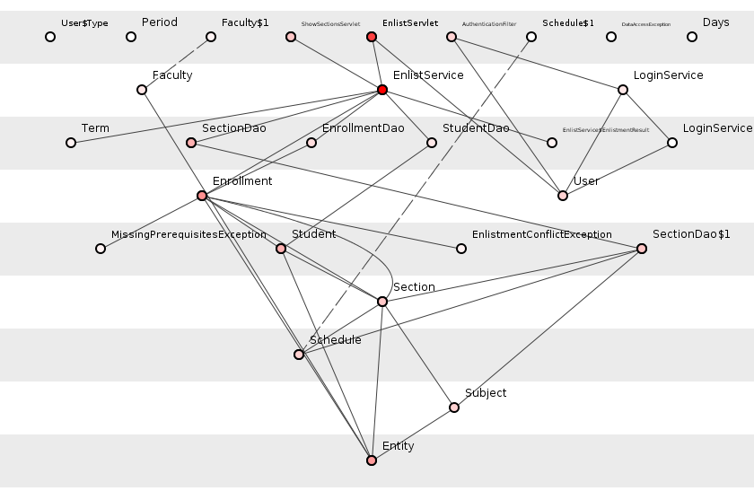

School-Registration-Web-App
===========================

Simple web app to demonstrate Object-Oriented Design, Test-Driven Development, GoF and Enterprise Design Patterns, Servlets, JSP, JSTL and JDBC. **[The use cases and class diagram can be found here.](https://docs.google.com/document/d/1KTiuKl44UfQUF1-vzyP9LJBXseoGpBLz-niyqOvSmEE/edit?usp=sharing)**

## Look Ma, No Interfaces!

Notice that I have eschewed Interfaces for the Services and DAOs. I've never encountered a project where you needed more than one implementation for each Service or each DAO. I think the Service-ServiceImpl pattern is a vestige of the EJB2 days. The only purpose I used to see for the interfaces was to create mock objects, back in the days when there were no mocking frameworks. However, now that we have mocking frameworks, that reason is gone, too. Just don't make your methods final so they can be mocked!

## Layer Supertype

The Entity class is the [Layer Supertype](http://martinfowler.com/eaaCatalog/layerSupertype.html) for all the domain entities. It's sole job is to hold a private key, to map each entity to a row in the database. This is set and get in the DAOs through Reflection. Hibernate uses Reflection as well to set and get final fields.

## Super-Simple Authentication

I created a very simple authentication component just to demonstrate Filters. This is not meant to be a recommended approach. Creating an effective, secure authentication framework is very, very difficult. For real systems, better rely on an established framework like Spring Security.

# How to Build & Run This Application

 1. Make sure you have Java Developer Kit (JDK) version 7 or above installed. Note that it must be a Java Developers Kit and not just a Java Runtime Environment (JRE).
 2. Have [Maven](http://maven.apache.org/) installed.
 3. Tomcat version 7 or above installed, or some other equivalent Java Servlet container.
 4. Be connected to the internet.
 5. Open a command terminal and navigate to the project directory.
 6. Run the command 'mvn package'. This will download dependencies, compile the code, create a directory called 'target', and create a file with a '.war' extension.
 7. Copy the .war file and paste it in the 'webapps' directory of Tomcat (or whatever is your Servlet container).
 8. Start Tomcat/servlet container.
 9. Open a browser and go to 'http://localhost:8080/{name of the war file (not including the .war extension)}

## Using Eclipse

If you would like to use Eclipse with this project, note that you will need to configure the Eclipse project to use Maven. Just right-click the project root and go to Configure --> Convert to Maven Project. After that, right-click the project root again and go to Maven --> Update Project. That should set up all your project dependencies.

# To Do
 * DAO layer using JDBC
 * MySQL DDL
 * Error Pages

# Analysis

I ran the code through Spoiklin Soice to do a graphical representation of the dependencies. Pretty clean, don't you think? I plan to do some other static analysis later on, maybe using SonarQube.

