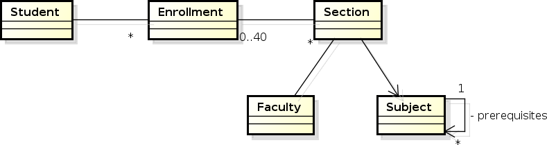

*Enrollment class - Represents an enrollment by a student into sections for a particular semester.

#1: Student Enrolls for Section

##Main Success Scenario:  

 1. Student enrolls in a section.  
 2. System verifies no schedule conflicts.    
 3. System verifies that student has taken the required prerequisite(s).  
 4. System adds section to student’s list of sections.   

##Extensions:

 1. System detects schedule conflict  
  a. System does not add section to student’s list but instead returns message informing user of schedule conflict
 2. System detects prerequiste/s not yet taken.  
  b. System does not add section to student’s list but instead returns message informing user of prerequisite conflict

##Business Rules:
 * Students are identified by their Student Number
 * Student cannot enroll in two sections with the same schedule.
 * Student cannot enroll in the same section twice.
 * Student cannot enroll in a section if he/she has not taken the prerequisite.
 * A section can accommodate a maximum of forty (40) students.
 * Maximum Load
  * A student may not exceed maximum enrollment load.
   * For Freshmen - maximum of 18 units
   * For 2nd yr & 3rd yr - maximum of 24 units
   * For 4th yr - maximum of 21 units

#2: Create New Sections
##Main Success Scenario:
 1. Section is created by selecting one teacher, one subject and one schedule.
 2. System verifies that all business rules are followed.
 3. System creates new section.

##Extensions:
 1. System detects that a business rule is not being followed.  
 	a. System informs user of conflict

##Business Rules:
 * A section is defined as a combination of a teacher, a subject, a schedule, a section number and a term.
 * Section numbers are manually assigned, but system must check that they are unique for the term.
 * Section numbers may duplicate as long as terms are different.
 * Each subject is worth three (3) units.
 * A teacher is identified by his/her Faculty ID.
 * A teacher cannot teach two sections with the same schedule.
 * Available schedules:  
 	* Days:  
 		* Mon/Thu, Tue/Fri, Wed/Sat  
 	* Periods  
 		* 8:30am-10am, 10am-11:30, 11:30am-1pm, 1pm-2:30pm, 2:30pm-4pm, 4pm-5:30pm

#3: Tuition Fee Assessment
##Main Success Scenario:
 1. System checks if student has enrolled in minimum load for this semester
 2. System calculates tuition fee.
 
##Business Rules:
 * Standard tuition fees are as follows:    
	 * Undergraduate subjects are ₱1,000 per unit.
	 * Graduate subjects are ₱1,500 per section.
	 * Miscellaneous fees are ₱2,000 flat rate.
 * Scholarship
	 * Some students may be on scholarship, either Half-Scholar or Full-Scholar
	 * Half-Scholars pay only 50% of subject fees but pay full on miscellaneous fees.
	 * Full-Scholars pay zero on subject fees but pay full miscellaneous fee.
 * Minimum Load  
	 * Tuition fee cannot be calculated unless student has enrolled in minimum load for the semester
	 * For Freshmen - minimum of 15 units
	 * For 2nd yr & 3rd yr - minimum of 18 units
	 * For 4th yr - no minimum
